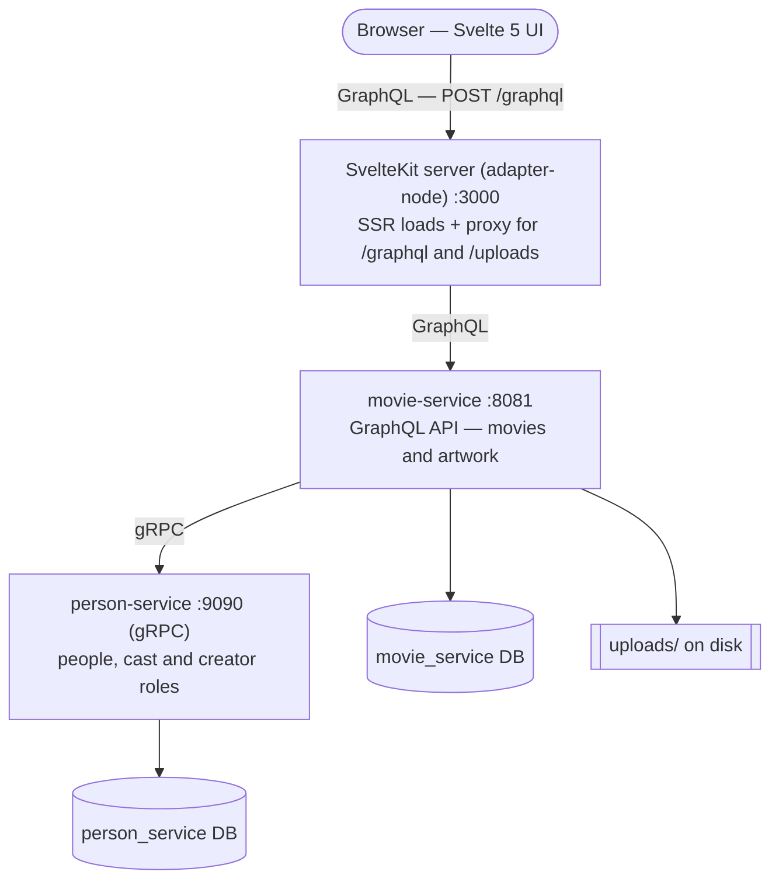

# Cinebase

A small movie manager: a **SvelteKit** frontend over a single **GraphQL** API, backed by two
**Kotlin / Spring Boot** services that talk to each other over **gRPC** and persist to
**PostgreSQL**.

The frontend never talks to `person-service`. Cast and creators are fetched by `movie-service` over
gRPC, so the two services keep separate databases and never read each other's tables.

The brief is covered end to end: **206 tests pass** (75 `movie-service`, 74 `person-service`,
57 `frontend`) and `docker compose up --build` brings the whole stack up from a clean state.

## What it does

| Requirement | Where it is implemented |
| --- | --- |
| List movies with artwork | `/` — responsive grid, cover artwork or a placeholder |
| Add / update / delete movies | Add and Edit dialogs, delete confirmation |
| Upload / replace / remove artwork | `/movies/[id]` artwork gallery — preview, upload progress, remove (the first artwork becomes the movie cover) |
| List cast and creators | `/movies/[id]` cast and creators sections |
| Add / update / delete people and roles | People dialogs; one reusable role dialog for cast and creators |
| Search movies, cast and creators | Debounced search on movies and people, plus a person picker inside the role dialog |
| Extras | Movie detail page, sorting, pagination, delete confirmation, upload preview |

Every async flow reports its state: loading, empty, error with retry, saving, deleting, uploading,
validation and success toasts.

## Architecture



Everything the browser requests goes through the SvelteKit server on port 3000, which server-renders
the first page and forwards `/graphql` and `/uploads` to `movie-service`. Keeping those URLs relative
is why `movie-service` needs no CORS configuration.

### Data ownership

| Service | Owns | Tables |
| --- | --- | --- |
| `movie-service` | `Movie`, `Artwork` | `movies`, `artworks` |
| `person-service` | `Person`, `MovieCast`, `MovieCreator` | `people`, `movie_cast`, `movie_creator` |

Both databases run in one PostgreSQL container (assessment scale), but no service ever queries the
other's tables. The cast list on a movie detail page is only reachable over gRPC.

## Repository layout

```
cinebase/
├── frontend/                  SvelteKit app — UI, SSR loaders, /graphql and /uploads proxy
├── movie-service/             GraphQL API, movies + artwork, gRPC client
├── person-service/            gRPC server, people + movie roles
├── proto/cinebase/person/v1/  person-service.proto — the shared service contract
├── docker/postgres/init/      creates the second database on first start
├── data/uploads/              artwork on the host, bind-mounted into the container
├── docker-compose.yml         postgres, person-service, movie-service, frontend
└── .env.example               every supported override (all have defaults)
```

## Quick start

Requires Docker only.

```bash
docker compose up --build
```

Then open <http://localhost:3000>.

- `docker compose down` stops everything and keeps the data.
- `docker compose down -v` also deletes the database volume.

The stack also starts if `movie-service` is reached before it has finished booting: the frontend
answers `503` with a readable message instead of an opaque `500`.

### Rebuilding after a change

Once you have edited a service, redeploy everything with the same command, run from the repo root:

```bash
docker compose up --build -d
```

Compose rebuilds the three services that have a `build:` section and recreates only the containers
whose image or configuration actually changed. `postgres` is left alone, the database survives on
the `postgres-data` volume, and artwork survives on the `./data/uploads` bind mount.

To rebuild just what you touched:

```bash
docker compose up --build -d movie-service                     # one service
docker compose up --build -d movie-service person-service      # two
```

| Changed | Rebuilt |
| --- | --- |
| `movie-service/**` / `person-service/**` | that service only |
| `proto/**` | **both** Java services — `COPY proto/` is the first layer in both Dockerfiles |
| `frontend/src/**` | frontend |
| `frontend/package-lock.json` | frontend, including a fresh `npm ci` |
| `docker-compose.yml` only | no rebuild; containers are just recreated |

Three things worth knowing:

- **Do not drop `--build`.** `docker compose up -d` reuses the existing images and silently keeps
  running your old code — the most common reason a change appears not to work.
- **Java rebuilds re-download Gradle dependencies every time.** Neither Dockerfile splits dependency
  resolution into its own layer or mounts a cache, so the Gradle cache lives and dies with that
  `RUN` step. Expect minutes per Java rebuild even for a one-line change.
- **Startup order is not readiness.** `movie-service` only waits for `person-service` to be
  *started*, and the JVMs take about seven seconds to boot, so requests in the first moments after a
  redeploy get the `503` described above rather than a failure.

```bash
docker compose ps                 # what is running, and postgres health
docker compose logs -f            # follow every service
docker compose down --rmi local   # delete the cinebase images, keep the data
```

None of this applies to local development without Docker: `./gradlew bootRun` and `npm run dev`
pick up changes on their own.

### Ports

| Service | Port | Notes |
| --- | --- | --- |
| frontend | 3000 | the only port you need |
| movie-service | 8081 | GraphQL at `POST /graphql`, artwork at `GET /uploads/**` |
| person-service | 9090 | gRPC — not reachable from the browser on purpose |
| person-service | 8082 | HTTP port is bound but exposes no API; all traffic is gRPC |
| postgres | 5432 | two databases: `movie_service`, `person_service` |

Every port can be changed in `.env` — see `.env.example`.

## GraphQL API

Endpoint: `POST http://localhost:8081/graphql` (POST only — Spring GraphQL does not serve GET).

Schema: [`movie-service/src/main/resources/graphql/schema.graphqls`](movie-service/src/main/resources/graphql/schema.graphqls)

```graphql
query {
  movies(search: "nolan", sort: {field: TITLE, direction: ASC}, page: 0, size: 12) {
    total
    totalPages
    items {
      id
      title
      releaseYear
      genre
      artworkUrl
    }
  }
}

mutation {
  createMovie(input: {title: "Arrival", releaseYear: 2016, genre: "Sci-Fi"}) {
    id
    title
  }
}
```

- `movies`, `movie`, `people` cover listing, details and search; `search` is a combined search across
  both.
- All movie, person, cast/creator and artwork mutations from the brief are present.
- Artwork uploads use the [GraphQL multipart request spec](https://github.com/jaydenseric/graphql-multipart-request-spec)
  against the same endpoint, so uploaded files arrive as a real `Upload` scalar.

## gRPC

Contract: [`proto/cinebase/person/v1/person-service.proto`](proto/cinebase/person/v1/person-service.proto)

`person-service` is the server, `movie-service` is the client. The frontend never calls it.

| Direction | RPCs |
| --- | --- |
| `movie-service` → `person-service` | `GetPeopleForMovie`, `SearchPeople`, `GetPerson`, `CreatePerson`, `UpdatePerson`, `DeletePerson`, `AddCastMember`, `UpdateCastMember`, `RemoveCastMember`, `AddCreator`, `UpdateCreator`, `RemoveCreator` |

The calls are one-way only — `person-service` never calls back, so there is no circular dependency.
In Compose the client target is the service name (`person-service:9090`), never `localhost`.

## Where the data lives

| Data | Storage |
| --- | --- |
| Movies | `movies` table in the `movie_service` database |
| Artwork metadata | `artworks` table — id, movie, public URL, type (`POSTER`, `BACKDROP`, `STILL`) |
| Artwork files | local disk under `uploads/artworks/` (host: `./data/uploads`), served at `/uploads/**` |
| People, cast, creators | `person_service` database |

The database only ever stores the artwork path; the bytes stay on disk. Uploads are limited to 10 MB
and PNG, JPEG, WEBP, GIF or AVIF — validated in the browser for instant feedback and again on the
server, which is what actually enforces the rule.

## Local development (without Docker)

Requires **JDK 21**, **Node 22+** and a local PostgreSQL.

```bash
psql postgres -c "CREATE ROLE cinebase LOGIN PASSWORD 'cinebase';"
createdb -O cinebase movie_service
createdb -O cinebase person_service
```

```bash
# 1. people service — gRPC on 9090
cd person-service && ./gradlew bootRun

# 2. movie service — GraphQL on 8081
cd movie-service && ./gradlew bootRun

# 3. frontend — http://localhost:5173, proxies /graphql and /uploads to 8081
cd frontend && npm install && npm run dev
```

Both services read their settings from `application.yml` with `localhost` defaults, so no environment
variables are needed locally. If your default JDK is newer than 21, set `JAVA_HOME` to a JDK 21 first.

## Tests

```bash
cd person-service && ./gradlew test    # 74 tests
cd movie-service  && ./gradlew test    # 79 tests
cd frontend       && npm test          # 57 tests
cd frontend       && npm run check     # svelte-check
```

| Suite | Coverage |
| --- | --- |
| `person-service` | CRUD and edge cases for people, cast and creators; case-insensitive search; role cleanup on person deletion; proto ↔ domain mapping; gRPC status contract (`NOT_FOUND`, `INVALID_ARGUMENT`, `INTERNAL`); full gRPC → JPA stack on H2 |
| `movie-service` | Movie CRUD, search, pagination clamps, sorting; artwork validation, replacement, removal and cover promotion; upload storage, after-commit file cleanup and path-traversal refusals; GraphQL end to end via `GraphQlTester`; gRPC client against an in-process server |
| `frontend` | Movie card and page rendering, loading/empty/error states, dialog validation and payloads, role dialog search and edit mode, artwork validation, preview and upload progress, SSR loaders |

Kotlin tests use JUnit (the version Spring Boot 4 supplies), MockK and AssertJ, plus `GraphQlTester`
and in-process gRPC / H2 for the integration layers. Frontend tests use Vitest with
`@testing-library/svelte` in jsdom.

## Notes on the implementation

Things that were not obvious, and how they were resolved and verified:

| Area | Problem | Resolution |
| --- | --- | --- |
| GraphQL uploads | Spring GraphQL does not implement the multipart request spec, so `Upload` could not work | Added `multipart-spring-graphql` instead of hand-rolling a servlet endpoint; the library's schema patch is switched off because the SDL already declares `scalar Upload` |
| gRPC config | `spring.grpc.client.channels.<name>.address` looks right but is ignored — the channel treats the name as a DNS host | Correct key is `spring.grpc.client.channel.<name>.target`; verified with a real cross-service call |
| Frontend in Docker | `adapter-auto` emits no runnable server outside a known platform, so the image had nothing to run | Switched to `adapter-node` |
| Relative URLs | Vite's dev proxy does not exist in production, so `/graphql` and `/uploads` 404'd | `frontend/src/hooks.server.ts` reproduces the proxy and keeps every URL relative (hence no CORS) |
| Large uploads | adapter-node caps request bodies at 512 KB, below the 10 MB artwork limit — uploads failed with `413` | `BODY_SIZE_LIMIT: 12M`; verified with a 2 MB upload stored byte-for-byte |
| CSRF | SvelteKit's origin check rejected the multipart upload when `Origin` differed (`127.0.0.1` vs `localhost`) while JSON queries kept working; dev skips the check, so it was easy to miss | `csrf.trustedOrigins: ['*']` — safe here because the app has no cookies or sessions |
| Lazy loading | `@urql/svelte`'s `queryStore` variables are not reactive, so search, sorting and pagination could not drive a query | Used the `@urql/core` client through small typed `request`/`mutate` wrappers instead |
| Postgres text columns | `@Lob` on a Kotlin `String` maps to PostgreSQL `oid` and breaks the existing `text` column | `@JdbcTypeCode(SqlTypes.LONG32VARCHAR)` |
| Artwork deletion | Rows are dropped inside a Spring `@Transactional` method while the files live on local disk, and a filesystem is not transactional — a rollback after the files were removed left surviving rows pointing at images that no longer existed | `UploadStorage.deleteByUrlAfterCommit` defers each file to a `TransactionSynchronization.afterCommit` callback and logs (never throws) on disk errors: the commit is the moment the files may follow the rows, and a rollback now leaves every file in place |
| Empty first paint | The first HTML was a loading placeholder, so the page looked empty until JavaScript ran | `/`, `/people` and `/movies/[id]` have `+page.server.ts` loaders that render the first page during SSR; only later interactions go to the browser |
| Test suite noise | The first pass had overlapping unit and integration cases (105 in `person-service`) | Audited and cut to 73 by removing duplicated status mapping, delegation-only and equivalent-boundary cases |

### Dependencies worth explaining

Only the non-obvious ones — the rest are Spring Boot or SvelteKit defaults.

- `multipart-spring-graphql` — adds the GraphQL multipart spec that Spring GraphQL lacks.
- `spring-boot-starter-grpc-client` / `-server` — first-class gRPC in Spring Boot 4; a `@Service`
  extending the generated `ImplBase` is registered automatically, so no manual Netty setup.
- `protobuf` Gradle plugin — generates the stubs from `proto/`, using versions supplied by the Spring
  Boot BOM.
- `@urql/core` — the only runtime frontend dependency; the frontend also hand-rolls the multipart
  request with `XMLHttpRequest`, which is the only way to get real upload progress.
- `bits-ui`, `tailwind-variants`, `svelte-sonner` — shadcn-svelte primitives, styling and toasts.
  Two more come along for the ride: `mode-watcher`, used only by the sonner component for its theme,
  and `@internationalized/date`, which bits-ui's single entry point pulls in whether you use a date
  picker or not.
- `mockk` (unit tests) and Mockito via `spring-boot-starter-test` (integration tests), plus H2 as a
  throwaway database for the JPA/GraphQL integration tests.

## Known limitations

Kept short and honest — these are deliberate scope decisions, not oversights.

- **No authentication or authorisation.** Explicitly out of scope in the brief; the CSRF check is
  disabled and the proxy trusts any origin, which is only acceptable because there is no session
  state anywhere.
- **One artwork set per movie** (poster, backdrop, still) with add and remove. No galleries, no
  reordering, no person photos.
- **Artwork is stored on the local filesystem**, so a multi-instance deployment would need shared
  storage or object storage. Files are deleted only after the database transaction commits, so a
  disk failure can leave an unreferenced file behind; setting up a sweep for those is out of scope
  here.
- **Schema is managed by Hibernate `ddl-auto: update`.** A real deployment would use Flyway or
  Liquibase migrations.
- **The combined `search(query:)` field is implemented and tested at the API level but unused by the
  UI**, which uses the dedicated movie and people search boxes.
- **Cast and creator lists are not paginated** (a film has few roles), and adding the same person
  twice as cast is allowed.
- **No gRPC retries, timeouts or circuit breaker.** If `person-service` is down, a movie detail query
  returns an error instead of degrading gracefully.
- **Both databases share one PostgreSQL container.** Separate databases, but separate instances and
  credentials would be the production shape.

## AI usage

I used **GitHub Copilot in VS Code (agent mode)** throughout, working one phase at a time against a
written plan that fixed the stack, the contracts and the order of work before any code was written.

**What Copilot generated.** Most of the first draft: Gradle and Spring configuration, entities,
repositories and services, the GraphQL controllers, the proto file and the gRPC client/server
wiring, the Svelte pages and components, the Dockerfiles and Compose file, and the bulk of the tests.

**What I reviewed and changed.** Nothing was accepted on the strength of it compiling. Every phase
ended with a real run, and that is where the interesting failures surfaced — the table above is the
result. In particular I had to correct the gRPC client property name, replace `adapter-auto` with
`adapter-node`, add the production proxy hook, raise the body size limit and relax the CSRF origin
check; none of those are visible without actually starting the stack. I also rejected
`@urql/svelte`'s `queryStore` once its variables proved non-reactive, and cut the first test suite
back after finding cases that only asserted their own mocks. Documentation and test counts written
earlier in the project were re-checked at the end and corrected where they had gone stale.

**How it was tested.** Each phase was verified by running it: `./gradlew test` and `npm test` for the
205 test cases, `npm run check` for the frontend types, and a clean
`docker compose down -v --rmi local && docker compose up --build` followed by manual end-to-end
checks — movie CRUD, search and pagination, cast and creators resolved over gRPC, a 2 MB artwork
upload served back over HTTP, cover promotion after removing artwork, a readable `503` when the
backend is stopped, and persistence across a restart.

I can explain every dependency and abstraction in this repository; the non-obvious ones are listed
above, and the reasoning behind the rest is in the README of each module.
